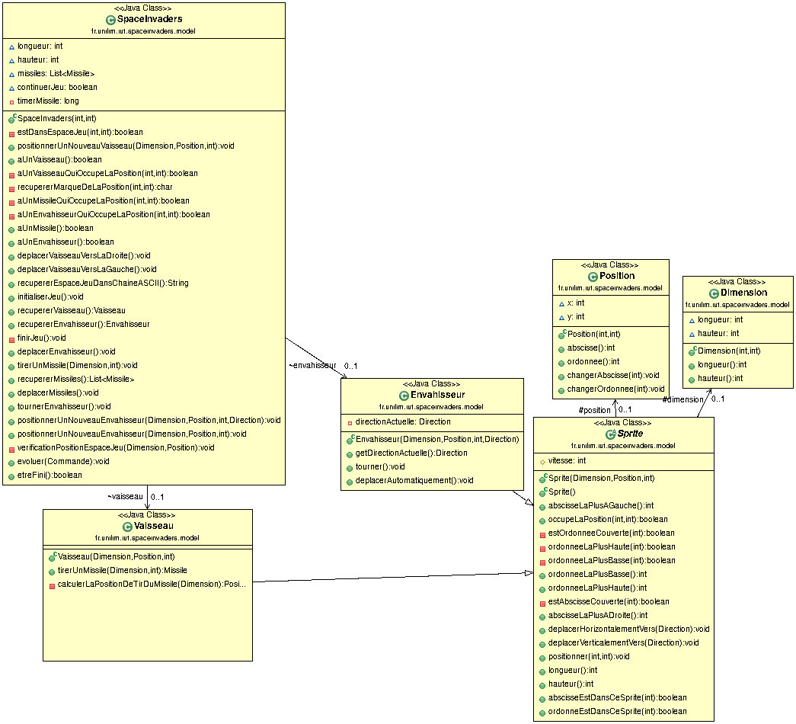
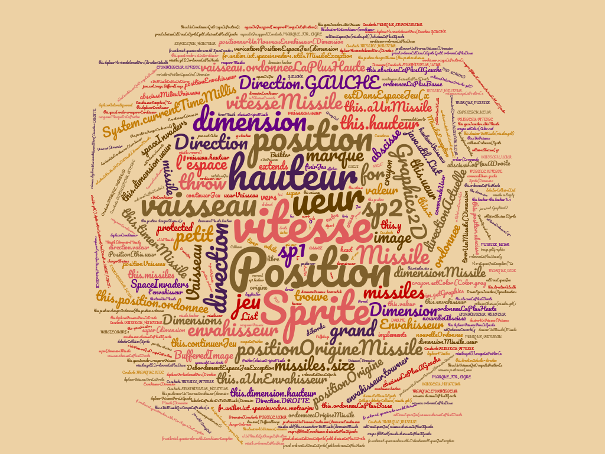

# Dépot du projet spaceinvaders
Ceci est mon dépot du projet Space Invaders du module M2104 (Base de la COO) de ma première année de DUT Informatique à Limoges.

Pour les nuages de mots, ne pas oublier de concaténer les fichiers avec :
> cat * >> ../FichierConcat.txt

Puis, Intégrer la blacklist
> cd ../ && wget https://raw.githubusercontent.com/iblasquez/tdd_spaceInvaders/master/enonces/ressources/JavaBlacklist.txt && 
cat FichierConcat.txt | grep -v JavaBlacklist.txt > FichieNuageDeMots.txt

Puis aller le créer sur :
> https://www.nuagesdemots.fr/

# Semaine du 29/04 au 05/05

## Description du travail effectué

J'avais déjà au préalable avancé jusqu'à la fonctionnalité 8 (tirer plusieurs missiles). Il me manquait un moyen de contrôler le temps entre l'apparition de deux missiles. Au début, j'ai tenté de créer une méthode afin de détecter tout missile dans les xx% au bas de l'écran, et ainsi attendre qu'elle renvoie "false" avant de tirer de nouveau.

Devant les problèmes survenus, j'ai donc décidé de plutôt me rediriger vers un contrôle de temps entre deux appuis sur la touche "espace", or, le problème est que ce "contrôle" ne s'effectue pas en cas de maintien de la touche. De plus, ce controle étant effectué via le contrôleur, je ne vois pas vraiment comment effectuer un test unitaire (que j'avais pourtant préparé en TDD pour l'autre méthode).

Finalement, j'y suis parvenu en mettant le timer dans la méthode tirerMissile de la classe SpaceInvaders, en TDD évidement (car le test est devenu possible).

## Diagramme de classes

 

## Nuage de mots

 

---
