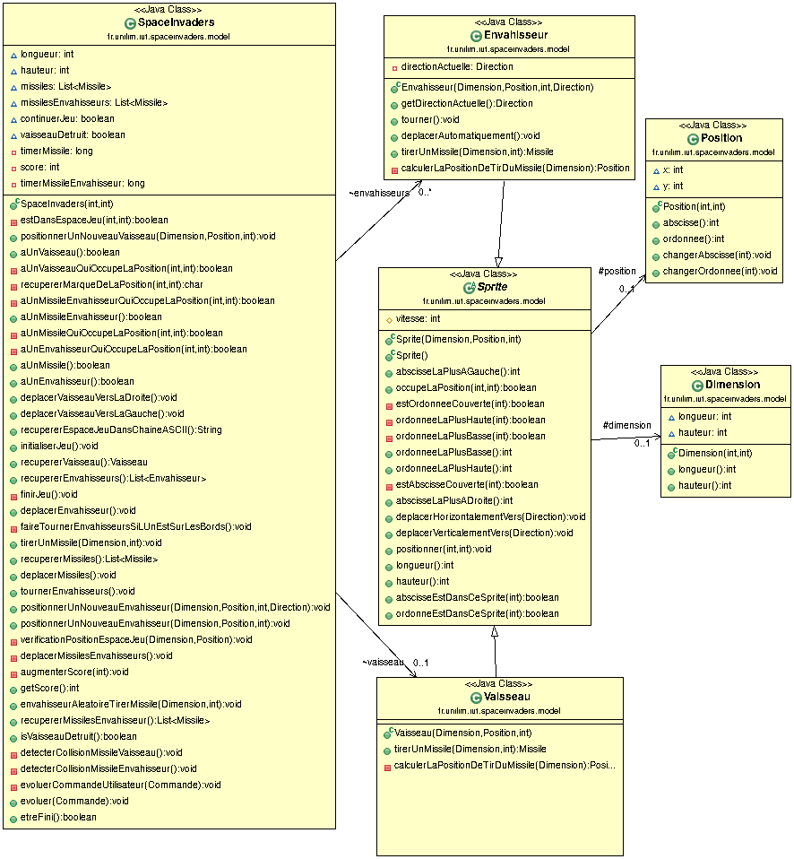

# Dépot du projet spaceinvaders
Ceci est mon dépot du projet Space Invaders du module M2104 (Base de la COO) de ma première année de DUT Informatique à Limoges.

Dans ce README se trouvera mon compte-rendu hebdomadaire, avec les diagrammes de classe ainsi que les nuages de mots du code "model".

Les consignes sont présentes ici :
> https://github.com/iblasquez/tdd_spaceInvaders

Sommaire :

- [Semaine du 29/04 au 05/05](#2904au0505)
- [Semaine du 06/05 au 12/05](#0605au1205)
- [Semaine du 13/05 au 19/05](#1305au1905)
- [Semaine du 20/05 au 24/05](#2005au2405)

## Tuto pour créer le nuage de mots

Dans le répertoire "src/main/java/fr/unilim/iut/spaceinvaders/model" :

Pour les nuages de mots, ne pas oublier de concaténer les fichiers avec :
> cat * > ../FichierConcat.txt

Puis, Intégrer la blacklist ;

Puis aller le créer sur :
> https://www.nuagesdemots.fr/

# Semaine du 29/04 au 05/05 

## Description du travail effectué

J'avais déjà au préalable avancé jusqu'à la fonctionnalité 8 (tirer plusieurs missiles). Il me manquait un moyen de contrôler le temps entre l'apparition de deux missiles. Au début, j'ai tenté de créer une méthode afin de détecter tout missile dans les xx% au bas de l'écran, et ainsi attendre qu'elle renvoie "false" avant de tirer de nouveau.

Devant les problèmes survenus, j'ai donc décidé de plutôt me rediriger vers un contrôle de temps entre deux appuis sur la touche "espace", or, le problème est que ce "contrôle" ne s'effectue pas en cas de maintien de la touche. De plus, ce controle étant effectué via le contrôleur, je ne vois pas vraiment comment effectuer un test unitaire (que j'avais pourtant préparé en TDD pour l'autre méthode).

Finalement, j'y suis parvenu en mettant le timer dans la méthode tirerMissile de la classe SpaceInvaders, en TDD évidement (car le test est devenu possible).

## Diagramme de classes

 

## Nuage de mots

 

---

# Semaine du 06/05 au 12/05 

## Description du travail effectué

Après la fonctionnalité pour tirer plusieurs missiles, j'ai implémenté la fonctionnalité pour avoir plusieurs envahisseurs. Pour celà, je suis passé par une liste, et j'ai intégré les vérifications afin que TOUTE la ligne se "retourne" si UN envahisseur touche un bord.

Évidement, j'ai également fait en sorte que la collision entre un missile et un envahisseur ne finisse pas le jeu mais ne détruise que cet envahisseur.

Enfin, j'ai intégré la fonctionnalité de gestion du score. Pour celà, je suis passé par un entier dans la classe SpaceInvaders, que j'ai incrémentée (de la valeur d'une Constante) à chaque envahisseur tué.

Ce score s'affiche en haut de l'écran grâce à la méthode "drawString" permettant de dessiner une chaine de caractère, après une conversion de l'entier évidement.

J'ai également pu utiliser cette méthode trouvée sur la documentation de la classe Graphics2D afin d'afficher un message de fin, à améliorer à l'avenir.

## Diagramme de classes

 

## Nuage de mots

 

---

# Semaine du 13/05 au 19/05 

## Description du travail effectué

Après l'affichage du score, j'ai pu passer à la fonctionnalité de tir de missile depuis les envahisseurs. J'ai donc créé une nouvelle liste de missile pour les leurs (comme ils n'ont pas les mêmes mouvement il en fallait une nouvelle).

Évidement, il s'agissait des mêmes missiles que ceux tirés par les vaisseaux, avec pour différences qu'ils vont vers le bas de l'écran, et qu'ils sont tirés tous les XXX ms (définies dans la classe Constante), et depuis un des envahisseurs au hasard.

Ensuite, il a fallu gérer la collision entre le vaisseau allié et les missiles ennemis, et ainsi, mettre fin au jeu en cas de collision (défaite du joueur).

Enfin, je me suis occupé de les dessiner à l'écran, et, pour finir, j'ai pu "dessiner" des messages de fin différent selon une victoire ou une défaite.

## Diagramme de classes

 

## Nuage de mots

 

---

# Semaine du 20/05 au 20/05 

## Description du travail effectué

Après l'implémentation des tirs de missiles envahisseurs ; j'ai pu initialise au début du jeu une horde d'envahisseurs, se déplaçant automatiquement de droite à gauche, puis, de haut en bas.

Enfin, j'ai pu leur faire tirer des missiles aléatoirement à un interval de temps délimité par une constante.

Il ne me manque plus qu'à faire en sorte que le jeu se termine dès leur arrivée au bas de l'écran.

## Diagramme de classes

 

## Nuage de mots

 

---
